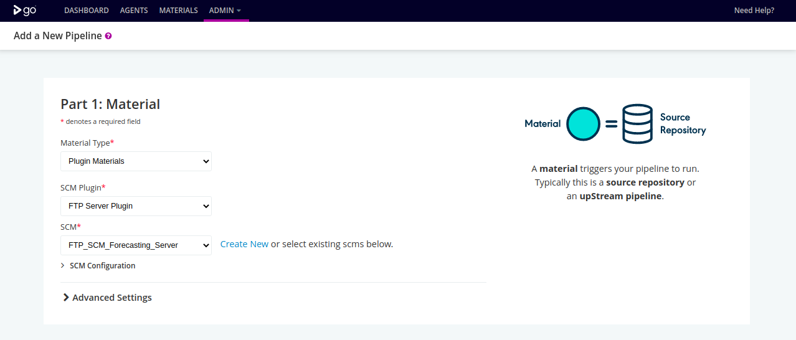

# gocd-ftp-server-plugin
GoCD Plugin that downloads the source codes/files from FTP Server from a configured directory path when the pipeline triggers


## When you can use this plugin

* When your deployment environment does not support repository access
* When you want to protect your source code

## How this plugin works

* Step 1: Setup FTP server and copy the source code into the home directory( this step can have dedicated server or build docker image with FTP Server setup and source code)
* Step 2: Configure GoCD server pipeline with FTP server details and directory path


- [Installation](#installation)
- [Usage](#usage)
  * [Via pipelines-as-code](#via-pipelines-as-code)
  * [Via UI wizards](#via-ui-wizards)
  * [Known issues](#known-issues)
- [Contributing](#contributing)
  * [Build](#build)
  * [Run](#run)
  * [Release](#release)

<!-- tocstop -->

## Installation

**Manually**
* Download from [releases](https://github.com/sekhar-rangam/gocd-ftp-server-plugin/releases)
* Follow the installation instructions [here](https://docs.go.cd/current/extension_points/plugin_user_guide.html#installing-and-uninstalling-of-plugins)

**Dockerized GoCD automatic plugin install**
* Find [release](https://github.com/sekhar-rangam/gocd-ftp-server-plugin/releases) URL
* Set environment variable like the below; replacing `${VERSION}`
    ```
    GOCD_PLUGIN_INSTALL_gocd-git-path-material-plugin=https://github.com/sekhar-rangam/gocd-ftp-server-plugin/releases/download/v${VERSION}/gocd-ftp-server-plugin-${VERSION}.jar
    ```

## Usage

### Via pipelines-as-code

Refer the GoCD API [Documentation](https://api.gocd.org/current/#create-a-pipeline) for creating a pipeline via api

In the below yaml format update SCM value with Pluggable SCMs Id created in GoCD ADMIN tab

```yaml
materials:
      FTP_SCM_Server:
        scm: 3154186a-4f0b-40a2-81db-c302108f5417
```

### Via UI wizards

Available from GoCD `19.8.0` onwards.





### Known issues